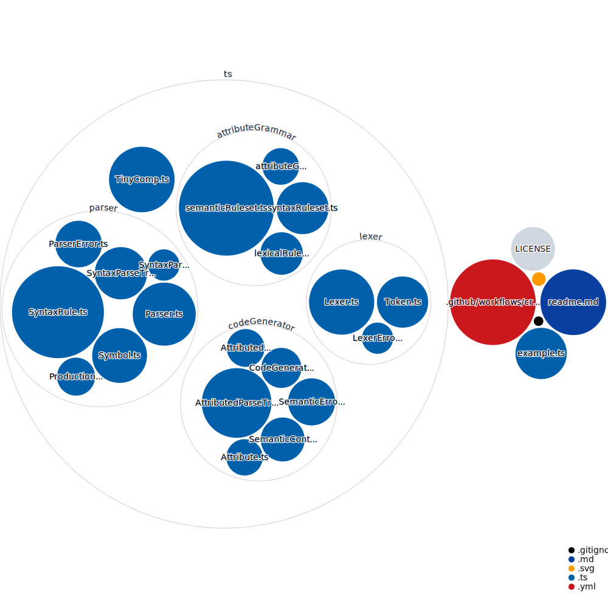

<div align="center"> 
<h1>🤖 TinyCompTS</h1>

A tiny (~ 26kb) Javascript/Typescript compiler written in vanilla Typescript as a hobby project.
</div>

## 🦾 Capabilities

- **Tokens**: [Maximum Munch](https://en.wikipedia.org/wiki/Maximal_munch), RegEx matching
- **Syntax**: 
  - [Recursive descent parser](https://en.wikipedia.org/wiki/Recursive_descent_parser)
    - → linear time complexity
    - → support for [LL-Type Context Free Grammars](https://en.wikipedia.org/wiki/LL_grammar)
  - Quantifier support (→ see example [SyntaxRuleset](/ts/attributeGrammar/syntaxRuleset.ts)):
    - `?` = zero or one
    - `*` = zero or more
    - `+` = one or more
- **Semantics**: Bottom-up, demand driven evaluation
  - → support for arbitrary, non-recursive [Attribute Grammars](https://en.wikipedia.org/wiki/Attribute_grammar)

## 📖 Guide

### 1. Define an **attribute grammar**

Create an object that implements [AttributeGrammar](/ts/attributeGrammar/attributeGrammar.ts):

1. Define a lexical ruleset by creating an object that implements [LexicalRuleset](/ts/attributeGrammar/lexicalRuleset.ts)
2. Define a syntax ruleset by creating an object that implements [SyntaxRuleset](/ts/attributeGrammar/syntaxRuleset.ts)
3. Define a semantic ruleset by creating an object that implements [SemanticRuleset](/ts/attributeGrammar/semanticRuleset.ts)

### 2. Configure TinyComp

1. Create an object that implements [TinyCompOptions](/ts/TinyComp.ts)
2. Create an instance of [TinyComp](/ts/TinyComp.ts) using the AttributeGrammar and TinyCompOptions object
3. Use `compiler.compile(input: string)` to compile input

## 📔 Example 

→ see [example.ts](/example.ts)

## Import

### 🦖 Denoland

```
import TinyComp, {...} from "https://deno.land/x/tiny_comp_ts/ts/TinyComp.ts";
```

### ❤️ Npm

```
npm i tiny-comp

import TinyComp, {...} from "tiny-comp";
```

### 🧪 Just test

1. Install the JS/TS runtime [Deno](https://deno.land/)
2. Clone this repo & navigate into the root directory
3. ```deno run ./example.ts```

Alternatively, run via docker

1. Clone this repo & navigate into the root directory
2. ```docker run -it -v $PWD:/app denoland/deno:1.17.1 run --allow-net /app/example.ts```

## 👨‍💻 Development

### Contributing

Feel free to make a pull request if you like. Keep it minimal and efficient.

### Codebase diagram:


